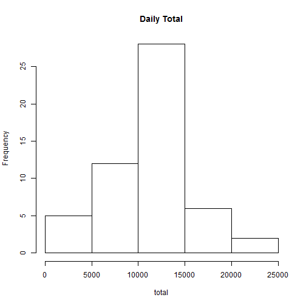
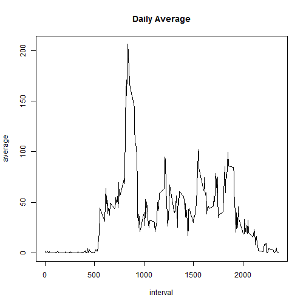
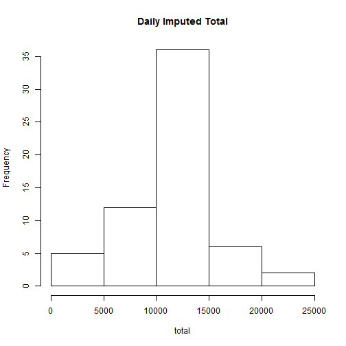
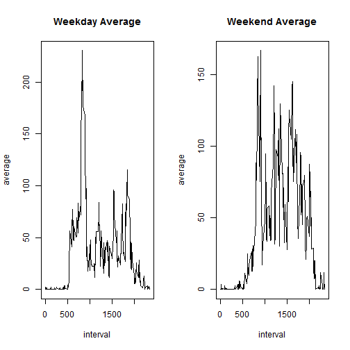

## Loading the needed libraries    
Below are the libraries needed:  

<pre class="knitr r">library(dplyr)
</pre>

## Loading and preprocessing the data  
Below is code that is needed to:  

1. Load the data  

<pre class="knitr r">activity &lt;- read.csv(&quot;activity.csv&quot;)
</pre>

2. Process/transform the data  

<pre class="knitr r">activity$date &lt;- as.Date(activity$date, &quot;%Y-%m-%d&quot;)
</pre>

## What is mean total number of steps taken per day?  
For this part of the assignment, I am ignoring the missing values in the dataset.  

1. Calculate the total number of steps taken per day  

<pre class="knitr r">dailyTotalSteps &lt;- activity %&gt;% group_by(date) %&gt;% summarise(total = sum(steps))
</pre>

2. Make a histogram of the total number of steps taken each day  

<pre class="knitr r">with(dailyTotalSteps, hist(total, main = &quot;Daily Total&quot;))
</pre>

3. Calculate the mean and median of the total number of steps taken per day  

<pre class="knitr r">mean(dailyTotalSteps$total, na.rm = TRUE)
</pre>

<pre class="knitr r">## [1] 10766.19
</pre>

<pre class="knitr r">median(dailyTotalSteps$total, na.rm = TRUE)
</pre>

<pre class="knitr r">## [1] 10765
</pre>

## What is the average daily activity pattern?  

1. Make a time series plot (i.e. type = "l") of the 5-minute interval (x-axis) and the average number of steps taken, averaged across all days (y-axis)  

<pre class="knitr r">intervalAveSteps &lt;- activity %&gt;% group_by(interval) %&gt;% summarise(average = mean(steps, na.rm = TRUE))
with(intervalAveSteps, plot(interval, average, type = &quot;l&quot;, main = &quot;Daily Average&quot;))
</pre>

2. Which 5-minute interval, on average across all the days in the dataset, contains the maximum number of steps?  

<pre class="knitr r">intervalAveSteps$interval[intervalAveSteps$average == max(intervalAveSteps$average)]
</pre>

<pre class="knitr r">## [1] 835
</pre>

## Imputing missing values  

1. Calculate and report the total number of missing values in the dataset  

<pre class="knitr r">sum(is.na(activity$steps))
</pre>

<pre class="knitr r">## [1] 2304
</pre>

2. Devise a strategy for filling in all of the missing values in the dataset.  

<pre class="knitr r">imputeStep &lt;- function(step, interval){
  if(is.na(step)) {
    round(intervalAveSteps$average[intervalAveSteps$interval == interval])
  } else {
    step
  }
}
</pre>

3. Create a new dataset that is equal to the original dataset but with the missing data filled in.  

<pre class="knitr r">newActivity &lt;- mutate(activity, steps = mapply(imputeStep, steps, interval))
</pre>

4. Make a histogram of the total number of steps taken each day and Calculate and report the mean and median total number of steps taken per day.  

<pre class="knitr r">newDailyTotalSteps &lt;- newActivity %&gt;% group_by(date) %&gt;% summarise(total = sum(steps))
with(newDailyTotalSteps, hist(total, main = &quot;Daily Imputed Total&quot;))
</pre>

<pre class="knitr r">mean(newDailyTotalSteps$total, na.rm = TRUE)
</pre>

<pre class="knitr r">## [1] 10765.64
</pre>

<pre class="knitr r">median(newDailyTotalSteps$total, na.rm = TRUE)
</pre>

<pre class="knitr r">## [1] 10762
</pre>

## Are there differences in activity patterns between weekdays and weekends?  

1. Create a new factor variable in the dataset with two levels - "weekday" and "weekend" indicating whether a given date is a weekday or weekend day.  

<pre class="knitr r">makeFactor &lt;- function(date){
  factor(weekdays(date) %in% c(&quot;Saturday&quot;,&quot;Sunday&quot;), levels = c(TRUE,FALSE), labels = c(&quot;weekend&quot;,&quot;weekday&quot;))
}
newActivity &lt;- mutate(newActivity, dayOfWeek = makeFactor(date))
</pre>

2. Make a panel plot containing a time series plot (i.e. type = "l") of the 5-minute interval (x-axis) and the average number of steps taken, averaged across all weekday days or weekend days (y-axis).  

<pre class="knitr r">weekdayActivity &lt;- newActivity %&gt;% filter(dayOfWeek == &quot;weekday&quot;) %&gt;% group_by(interval) %&gt;% summarise(average = mean(steps))

weekendActivity &lt;- newActivity %&gt;% filter(dayOfWeek == &quot;weekend&quot;) %&gt;% group_by(interval) %&gt;% summarise(average = mean(steps))

par(mfrow = c(1, 2))
with(weekdayActivity, plot(interval, average, type = &quot;l&quot;, main = &quot;Weekday Average&quot;))
with(weekendActivity, plot(interval, average, type = &quot;l&quot;, main = &quot;Weekend Average&quot;))
</pre>

